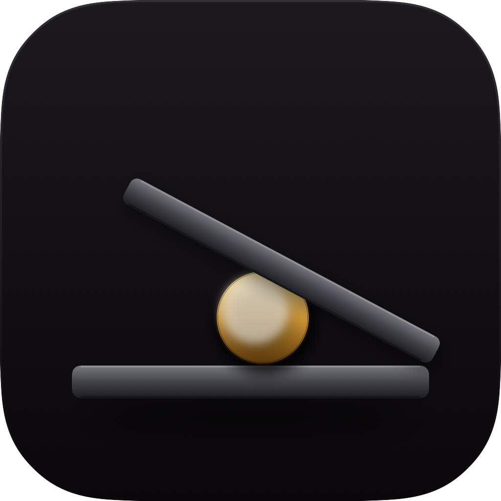

<p align="center">
  
</p>

<h1 align="center">Wedge</h1>

<p align="center">
  <em>Keep your Mac awake with the lid closed — for long AI-agent sessions, builds, and downloads. Without burning your battery.</em>
</p>

<p align="center">
  
  
  
</p>

---

## Why

If you code with AI agents (Claude Code, Cursor, Aider) or run long builds, closing the lid kills your session. The usual `pmset disablesleep` workaround keeps the Mac awake — but it also keeps the **internal display awake under the closed lid**, silently burning battery for hours.

Wedge does two things:

1. **Holds your Mac open** — toggles `pmset -a disablesleep 1` so the system stays awake when the lid is closed.
2. **Turns off the internal display when the lid closes** — saves battery, restores your previous brightness automatically when you open the lid again.

## Install

Download the latest `Wedge.zip` from the [Releases page](https://github.com/wwaannttyy/Wedge/releases), unzip, and drag `Wedge.app` to `/Applications/`.

**First launch:** right-click the app → **Open** — Wedge is open-source and not signed with a paid Developer ID, so Gatekeeper will warn you on first run. After that it's silent.

If you'd rather skip the click-through, strip the quarantine attribute manually:

```bash
xattr -dr com.apple.quarantine /Applications/Wedge.app
```

## How it works

Click the menubar icon (a tiny side-view MacBook) to open the menu — or **pull the cord**:

- **Drag the icon downward.** A braided cord with a brass bead extends from the menubar, following your cursor with cord-tension physics.
- **Past a small threshold** you'll hear a click and the bead glows gold — that's the commit point.
- **Release** and the lid icon in the menubar latches open. The wedge is in.
- **Pull again** to release. The cord retracts, the lid closes, and the Mac is free to sleep.

While the wedge is in and you close the lid, Wedge sets the internal display brightness to 0. When you open the lid back up, it restores your previous brightness.

## Features

- 🪶 **Lightweight** — single Swift binary, no background daemons, no helper tools
- 🔒 **Admin password lives in your Keychain**, never touched after Wedge quits
- 🌍 **Localized** — English and Русский
- 🌒 **Launch at login** via `SMAppService`
- 🧯 **Crash-safe** — if the app dies mid-cycle, brightness is restored on next launch
- 🎯 **No private daemons, no kexts.** Just `pmset` (driven by your Keychain-stored admin password) and a thin call into `DisplayServices` for brightness control

## Settings

| Setting | Default | Notes |
| --- | --- | --- |
| Launch Wedge at login | off | Uses `SMAppService.mainApp` (approve once in System Settings → Login Items) |
| Turn off internal display when lid closes | **on** | The whole reason Wedge exists. Can be disabled if you want raw `pmset` behavior. |
| Saved password | stored in Keychain | "Forget" wipes it; Wedge will re-prompt next time you pull the cord |
| Language | System default | English / Русский. Switching prompts a relaunch. |

## Requirements

- macOS 14 Sonoma or later
- Apple Silicon recommended (Intel may work but is untested)

## Build from source

```bash
git clone https://github.com/wwaannttyy/Wedge.git
cd Wedge
./build.sh release
open build/Wedge.app
```

To regenerate the app icon:

```bash
swift run WedgeIcon
```

## Privacy

- Wedge **never makes a network connection**.
- Your admin password lives in your Keychain, accessible only to Wedge.
- Wedge does not collect, transmit, log, or phone home with anything.

## Limitations

- Wedge depends on a private `DisplayServices` symbol to control brightness. This means **App Store distribution is not possible** — that's a hard trade-off for the lid-close brightness feature.
- On Macs with no internal display (Mac mini, Studio, Pro), the brightness step is a no-op — the rest still works.
- macOS will sleep the Mac at very low battery regardless of `pmset` (hardware-enforced). There is no workaround.

## License

MIT. See [LICENSE](LICENSE).
